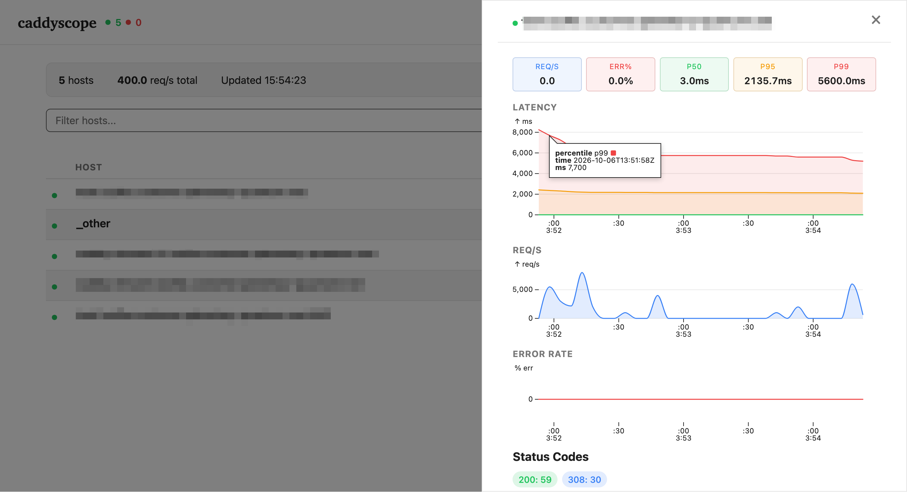

# caddyscope

A Caddy module that serves a live dashboard of your virtual hosts, request
metrics, and upstream health.

> [!TIP]
> Check out [quantum-caddy](https://github.com/hostwithquantum/quantum-caddy) for a ready distribution.

- lists every vhost from the running config, with listen addresses and reverse proxy upstreams
- per-host request counts, error rates and latency from Caddy's metrics
- pushes updates over server-sent events, no polling
- protected by basic auth (bcrypt)



## Install

```sh
xcaddy build --with github.com/luzilla/caddyscope
```

For a Docker example see [docs/build.md](docs/build.md).

## Configure

```caddyfile
{
    metrics {
        per_host
    }
}

scope.example.com {
    caddyscope /dashboard {
        username admin
        password $2a$14$...   # caddy hash-password
        refresh  5s
    }
}
```

| Option     | Required | Default | Notes                                  |
|------------|----------|---------|----------------------------------------|
| `<path>`   | yes      |         | URL prefix the dashboard is mounted on |
| `username` | yes      |         | basic auth user                        |
| `password` | yes      |         | bcrypt hash, `$2a$` or `$2b$`          |
| `refresh`  | no       | `5s`    | how often a snapshot is pushed         |

`metrics { per_host }` is required. Without it Caddy adds no `host` label
to its metrics and the stats table stays empty.

The module orders itself after `basicauth`, so no `order` global option is
needed. `{$ENV_VAR}` placeholders work for the hash.

## Endpoints

All paths are relative to the configured prefix and need basic auth.

| Path          | Returns                                   |
|---------------|-------------------------------------------|
| `/`           | the dashboard                             |
| `/api/vhosts` | vhosts with upstreams, JSON               |
| `/api/stats`  | per-host stats, JSON                      |
| `/api/stream` | server-sent events with both, per refresh |

## Deploy

Docker Swarm, with a static Caddyfile or caddy-docker-proxy labels:
[docs/deployment.md](docs/deployment.md).

## Development

```sh
make setup    # install xcaddy
make run-dev  # build and run with the sample Caddyfile on :2080
make test
make lint
```

Dashboard: <http://localhost:2080/dashboard>, user `admin`, password `admin`.
